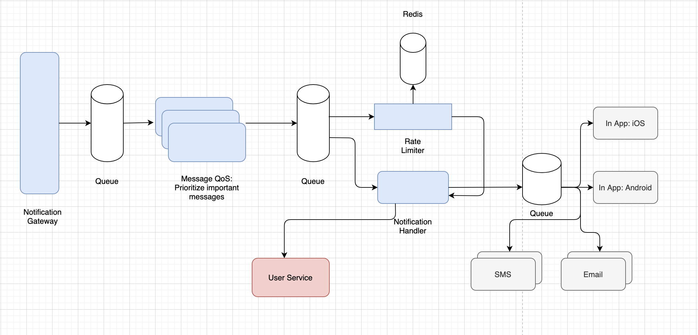

# Zagel

[](https://nodesource.com/products/nsolid)

Zagel is a scalable & highly performant notfication service. 

## High Level Design


## Features

- Prioritize messages 
- Plug & Play model for new Gateway Providers

## Tech

Zagel uses a number of open source projects to work properly:

- [node.js] - evented I/O for the backend
- [Express] - fast node.js network app framework [@tjholowaychuk]

## Installation

Zagel requires [Node.js](https://nodejs.org/) v10+ to run.

Install the dependencies and devDependencies and start the server.

```sh
npm i
npm start
```
